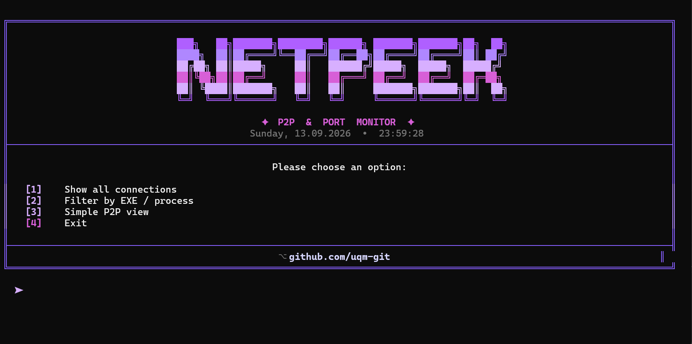

### ✦ P2P & Port Monitor ✦

A sleek terminal-based network connection monitor with a purple aesthetic,
P2P detection, live geolocation and smooth animations.

[](https://www.python.org/)
[](https://github.com/uqm-git)


## ✦ Overview

**NetPeek** is a lightweight, dependency-minimal network monitor that runs
right in your terminal. It shows every active connection on your machine,
highlights **P2P traffic**, resolves the **country of remote peers** in
real time.

<div align="center">



</div>

## ✦ Installation

### 1. Clone
```bash
git clone https://github.com/uqm-git/netpeek.git
cd netpeek
```

### 2. Install dependency
```bash
pip install psutil
```

### 3. Run
```bash
python netpeek.py
```

## ⚠ Disclaimer & Legal Notice

**NetPeek is intended for educational, diagnostic and legitimate
administrative use only.**

- **Do not use NetPeek to stalk, harass, dox, threaten, or otherwise
  harm anyone.** Obtaining someone's IP address without their consent
  and using it against them is illegal in most jurisdictions.
- Using a peer's IP for a DoS/DDoS attack, swatting, or any form of
  cyberattack is a **criminal offense** and will be reported.
- Recording, publishing, or sharing another person's IP address
  without their explicit permission may violate privacy laws such as
  the **GDPR** (EU), **CCPA** (California), and similar regulations
  worldwide.
- You are **solely responsible** for how you use this tool. The author
  accepts **no liability** for any damage, legal consequence, or
  misuse.
- If you discover a peer's IP by accident, **do not share it, do not
  save it, do not act on it.**

By using NetPeek you agree to use it **only** for:
- Diagnosing your own network issues
- Monitoring your own outbound connections
- Educational exploration of P2P networking
- Legitimate security auditing on systems you own or have written
  permission to test

**If you are unsure whether your intended use is legal — don't do it.**


<div align="center">

**Made with ♥ and a lot of purple**

[github.com/uqm-git](https://github.com/uqm-git)

</div>
